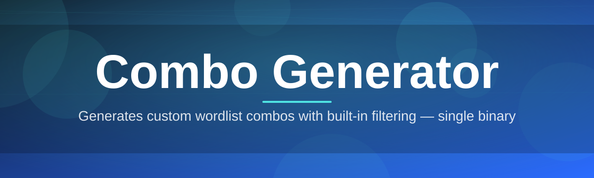
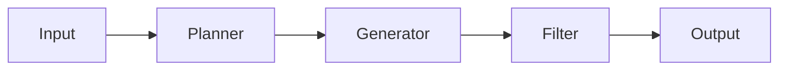

# combo-gen-tool 🧪⚡

  

*A combo generator that actually respects your CPU, your time, and your sanity.*

## 🎯 Overview

Let's be honest — most "combo generator" tools out there are either bloated Java monstrosities from 2014 or sketchy single-file scripts you're too afraid to run twice. **combo-gen-tool** is neither. It's a purpose-built, native Windows utility for generating structured wordlists and combination sets from custom rulesets — think character pools, length ranges, pattern masks, and dictionary blending, all wrapped in an interface that doesn't look like it was designed by someone who hates you.

Why does this exist? Because combinatorics tooling has been stagnant for a decade. QA engineers need permutation sets for fuzz testing. Security researchers need custom wordlists for authorized pentest engagements. Developers need bulk test data that follows specific patterns. Hobbyists building password-strength demos need believable sample sets. All of these people were stuck choosing between ancient abandonware and building their own generator from scratch every single time. We got tired of that cycle, so we built the tool we wished existed.

Who is this for? If you work anywhere near data generation, QA automation, authorized security research, or you just find combinatorics genuinely satisfying (no shame, we get it) — this is your toolbox. It's not trying to be everything. It's trying to be the *one* combo generator that's fast, predictable, and doesn't ask fifteen questions before it lets you export a file.

  

---

## 🔥 What Makes It Tick

> [!TIP]
> Every capability below was built because a real workflow needed it — not because it sounded good on a feature list.

| Capability | What It Actually Does |
|---|---|
| **Pattern Masking** | Define exact structure like `?u?l?l?d?d` and the engine builds every valid combination matching that skeleton — no guesswork, no waste. |
| **Charset Sculpting** | Mix custom character pools (upper, lower, digits, symbols, or your own alphabet) per position, not just globally. |
| **Dictionary Fusion** | Blend wordlists with generated fragments so output feels structured, not random noise. |
| **Range-Based Length Control** | Set min/max length independently and let the generator sweep the entire range in one pass. |
| **Live Output Streaming** | Watch combinations populate in real time instead of staring at a frozen progress bar praying it didn't crash. |
| **Duplicate Suppression** | Built-in dedup logic so your output file isn't secretly 40% redundant garbage. |
| **Export Format Control** | Plain `.txt`, chunked files by size, or delimiter-separated output — pick what your downstream tool actually accepts. |
| **Session Snapshots** | Pause a massive generation job and resume later without losing your place. |

> [!NOTE]
> Pattern Masking and Dictionary Fusion can run **simultaneously** — you can anchor a prefix from a wordlist and let the suffix roam freely across a charset. That combo (pun very much intended) is where the tool shines brightest.

---

## 🚀 Getting Off the Ground

Getting started takes less time than reading this section:

1. Hit the download button above (or below, we're not picky) to reach the landing page.
2. Grab the latest Windows build — it's a single executable, no installer wizard nonsense.
3. Run it. Windows SmartScreen might grumble since it's a smaller independent project — click "More info" → "Run anyway."
4. Set your pattern, charset, or dictionary source, hit **Generate**, and export.

That's it. No accounts, no telemetry opt-ins, no fifteen-step onboarding tutorial.

---

## 💻 System Requirements

- Windows 10 or Windows 11 (64-bit)
- Standalone executable — zero external dependencies
- ~50MB free disk space for the app itself
- Additional disk space scales with your output size (large combination sets can get *large*, plan accordingly)
- No admin rights required for standard use

  

---

## ⚙️ How It Works

The internal pipeline is deliberately simple — complexity is the enemy of a tool that needs to run reliably at 2am when you're mid-project:

1. **Input Parsing** — your pattern, charset rules, or dictionary files get validated and normalized.
2. **Combination Planning** — the engine calculates total output size upfront so you know what you're getting into before it starts.
3. **Generation Pass** — combinations are produced in batches, streamed rather than held entirely in memory.
4. **Dedup & Filter** — optional filters strip duplicates or entries that don't match secondary constraints.
5. **Export** — results land in your chosen format, chunked if needed.

> [!IMPORTANT]
> Generation planning happens *before* any output is written. If your parameters would produce an absurd number of combinations, the tool warns you first instead of silently eating your disk space overnight.

---

## 🧩 Troubleshooting Corner

<strong>The app won't launch — Windows says it's "unrecognized."</strong>

This is standard SmartScreen behavior for smaller independently-published tools without a big-name code-signing certificate. Click "More info," then "Run anyway." It's not malware, it's just not from a Fortune 500 company.

<strong>Generation seems to have frozen at a huge combination count.</strong>

It's probably not frozen — it's streaming. Extremely large charset + length combinations can produce billions of results. Check the live counter; if it's climbing, it's working. Consider narrowing your length range if you don't need the full sweep.

<strong>My export file is way bigger than expected.</strong>

Combinatorics grows fast. Adding one extra character to your pool or one extra position to your length range can multiply output size dramatically. Use the Planning step's size estimate before committing to a full run.

<strong>Dictionary Fusion isn't blending the way I expected.</strong>

Double-check your anchor position settings — Fusion mode treats the dictionary entry as a fixed segment, not a flexible one. If you want variation *within* the dictionary portion too, switch to Pattern Masking instead for that segment.

<strong>Can I run multiple generation jobs at once?</strong>

Not currently — the engine is single-session by design to keep memory usage predictable. Queue your jobs sequentially instead; Session Snapshots make this painless.

---

## 🎨 Interface & Experience

The UI leans minimal on purpose — fewer panels, more clarity.

- `Ctrl + G` — start generation
- `Ctrl + S` — save current session snapshot
- `Ctrl + E` — export current output
- `Esc` — pause active generation

Themes: Light, Dark, and a genuinely nice **Amber** theme that doesn't look like it was picked at random (it wasn't — someone on the team has strong opinions about color contrast).

Settings persist locally between sessions — no cloud sync, no account, your configuration just... stays where you left it. Novel concept, we know.

---

## 🤝 Contributing & Community

This project grew because people who actually use combinatorics tooling started filing issues, suggesting patterns they wished existed, and occasionally submitting pull requests at 3am. That energy is welcome.

- Found a bug? Open an issue with reproduction steps.
- Have a feature idea? Discussions are open — pitch it.
- Want to contribute code? Fork, branch, PR. Keep changes focused; one idea per pull request makes review painless for everyone.

> [!WARNING]
> This tool is built for legitimate use cases — QA testing, authorized research, data generation, and educational purposes. Don't be the reason a good tool gets a bad reputation.

---

## 📜 License

Released under the [MIT License](LICENSE), 2026. Use it, fork it, build on it — just keep the license notice intact.

---

## ⚠️ Disclaimer

combo-gen-tool is provided "as is" for lawful, authorized, and educational purposes only. The maintainers are not responsible for misuse of this software. Always ensure you have proper authorization before applying generated combinations against any system, service, or dataset that isn't your own.

  

